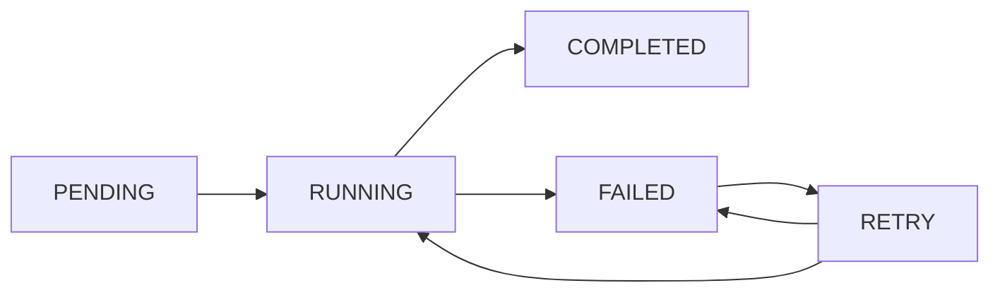

# Architecture Documentation

This document provides an in-depth technical overview of the Business Automation System architecture.

## Table of Contents

1. [System Overview](#system-overview)
2. [Multi-Agent Architecture](#multi-agent-architecture)
3. [Multi-Tenant Database Design](#multi-tenant-database-design)
4. [Workflow Orchestration](#workflow-orchestration)
5. [Event-Driven Communication](#event-driven-communication)
6. [Quality Grading System](#quality-grading-system)
7. [Security & Authentication](#security--authentication)
8. [Scalability Considerations](#scalability-considerations)

## System Overview

### High-Level Architecture

```
┌─────────────────────────────────────────────────────────────────┐
│                     WEB DASHBOARD (Next.js 16)                   │
│  Real-time monitoring, project management, agent control panel   │
└────────────────────────────┬─────────────────────────────────────┘
                             │
                             ↓
┌─────────────────────────────────────────────────────────────────┐
│                     API LAYER (tRPC / REST)                      │
│        Type-safe, authenticated, tenant-isolated endpoints       │
└────────────────────────────┬─────────────────────────────────────┘
                             │
                             ↓
┌─────────────────────────────────────────────────────────────────┐
│               ORCHESTRATION LAYER (Mastra + XState)              │
│  ┌──────────────┐  ┌──────────────┐  ┌──────────────┐          │
│  │   Website    │  │   Content    │  │   Workflow   │          │
│  │  Generation  │  │  Generation  │  │ Orchestrator │          │
│  └──────────────┘  └──────────────┘  └──────────────┘          │
└────────────────────────────┬─────────────────────────────────────┘
                             │
                             ↓
┌─────────────────────────────────────────────────────────────────┐
│                  AGENT EXECUTION LAYER                           │
│  ┌────────────┐ ┌────────────┐ ┌────────────┐ ┌─────────────┐  │
│  │ Discovery  │ │  Design &  │ │  Content   │ │    Code     │  │
│  │  Agents    │ │  Branding  │ │  Agents    │ │ Generation  │  │
│  │  (8)       │ │  Agents    │ │  (10)      │ │  Agents     │  │
│  │            │ │  (10)      │ │            │ │  (5)        │  │
│  └────────────┘ └────────────┘ └────────────┘ └─────────────┘  │
│                                                                   │
│  ┌────────────────────────────────────────────────────────────┐ │
│  │           Quality Grading Agents (5)                       │ │
│  │  Performance | SEO | Accessibility | Code | Content       │ │
│  └────────────────────────────────────────────────────────────┘ │
└────────────────────────────┬─────────────────────────────────────┘
                             │
                             ↓
┌─────────────────────────────────────────────────────────────────┐
│                    WORKFLOW ENGINE (Inngest)                     │
│  Event-driven execution, durable workflows, automatic retries   │
└────────────────────────────┬─────────────────────────────────────┘
                             │
                             ↓
┌─────────────────────────────────────────────────────────────────┐
│                   BACKGROUND JOBS (BullMQ)                       │
│  Scheduled tasks, recurring jobs, email/SMS queues              │
└────────────────────────────┬─────────────────────────────────────┘
                             │
                             ↓
┌─────────────────────────────────────────────────────────────────┐
│                    MCP SERVER INTEGRATIONS                       │
│  ┌──────────┐ ┌──────────┐ ┌──────────┐ ┌──────────┐           │
│  │Playwright│ │Filesystem│ │PostgreSQL│ │Scheduler │ ...       │
│  └──────────┘ └──────────┘ └──────────┘ └──────────┘           │
└────────────────────────────┬─────────────────────────────────────┘
                             │
                             ↓
┌─────────────────────────────────────────────────────────────────┐
│              DATA & STORAGE LAYER                                │
│  ┌──────────────┐  ┌──────────────┐  ┌──────────────┐          │
│  │  PostgreSQL  │  │    Redis     │  │  S3/R2       │          │
│  │  (Prisma)    │  │  (Upstash)   │  │  (Assets)    │          │
│  └──────────────┘  └──────────────┘  └──────────────┘          │
└─────────────────────────────────────────────────────────────────┘
```

## Multi-Agent Architecture

### Agent Hierarchy

The system uses a **supervisor pattern** where a central orchestrator agent coordinates specialized sub-agents.

```
                  ┌─────────────────┐
                  │  ORCHESTRATOR   │
                  │     AGENT       │
                  └────────┬────────┘
                           │
         ┌─────────────────┼─────────────────┐
         │                 │                 │
    ┌────▼────┐      ┌────▼────┐      ┌────▼────┐
    │Discovery│      │ Design  │      │ Content │
    │ Layer   │      │ Layer   │      │ Layer   │
    └────┬────┘      └────┬────┘      └────┬────┘
         │                │                 │
    8 agents         10 agents         10 agents
```

### Agent Lifecycle



### Agent Communication

Agents communicate through:

1. **Direct Output** - Output of one agent becomes input to another
2. **Shared Context** - Workflow context accessible to all agents
3. **Event Bus** - Agents can publish/subscribe to events
4. **Database** - Persistent state in PostgreSQL

## Multi-Tenant Database Design

### Tenant Isolation Strategy

We use **Shared Schema with Row-Level Security (RLS)** for optimal scalability.

**Advantages:**
- Scales to millions of tenants
- Efficient connection pooling
- Simpler migrations
- Database-level security

**Implementation:**
```sql
-- Enable RLS on projects table
ALTER TABLE projects ENABLE ROW LEVEL SECURITY;

-- Policy: Users can only see their tenant's projects
CREATE POLICY tenant_isolation_policy ON projects
  USING (tenant_id = current_setting('app.current_tenant_id')::uuid);
```

### Tenant Context Management

```typescript
// Set tenant context before queries
await setTenantContext(tenantId);

// All subsequent queries are automatically filtered
const projects = await prisma.project.findMany();
// Only returns projects for the current tenant

// Clear context when done
await clearTenantContext();
```

### Database Schema

**Core Tables:**
- `tenants` - Organizations using the system
- `users` - Users within tenants (RBAC)
- `company_profiles` - Comprehensive client data
- `projects` - Automation projects
- `workflow_definitions` - Reusable workflow templates
- `workflow_executions` - Workflow runs
- `agent_executions` - Agent task executions
- `generated_assets` - Output artifacts
- `website_evaluations` - Quality grades

## Workflow Orchestration

### Mastra + XState Integration

**Mastra** provides:
- Agent coordination
- Task routing
- State management
- Retry logic

**XState** provides:
- State machine modeling
- Hierarchical states
- Parallel execution
- Conditional transitions

### Example Workflow

```typescript
const websiteGenerationWorkflow = {
  id: 'website-generation',
  steps: [
    {
      id: 'discovery',
      type: 'parallel',
      agents: [
        'business_requirements',
        'service_definition',
        'brand_identity',
        'seo_strategy',
      ],
    },
    {
      id: 'design',
      type: 'parallel',
      dependencies: ['discovery'],
      agents: [
        'color_palette',
        'typography',
        'layout_architecture',
      ],
    },
    {
      id: 'quality',
      type: 'parallel',
      dependencies: ['code'],
      agents: [
        'performance_evaluator',
        'seo_evaluator',
        'accessibility_evaluator',
      ],
    },
    {
      id: 'refine',
      type: 'conditional',
      condition: 'shouldRefine',
      action: 'restart_failed_agents',
    },
  ],
};
```

## Event-Driven Communication

### Event Types

```typescript
enum EventType {
  // Workflow Events
  'workflow.started',
  'workflow.step.started',
  'workflow.step.completed',
  'workflow.completed',
  'workflow.failed',

  // Agent Events
  'agent.started',
  'agent.completed',
  'agent.failed',
  'agent.output',
  'agent.progress',

  // Project Events
  'project.created',
  'project.updated',
  'project.completed',
}
```

### Event Flow

```
Agent A completes
      ↓
Publishes 'agent.completed' event
      ↓
Orchestrator receives event
      ↓
Updates workflow state
      ↓
Triggers dependent agents
      ↓
Notifies dashboard via WebSocket
```

## Quality Grading System

### LLM-as-Judge Pattern

Quality evaluation uses Claude as an impartial judge:

```typescript
const evaluation = await claude.messages.create({
  model: 'claude-4.5-sonnet',
  messages: [
    {
      role: 'user',
      content: `Evaluate this website for ${dimension}.
                Provide a score (0-1), grade (A-F), and specific feedback.`,
    },
  ],
});
```

### Grading Dimensions

1. **Performance** (via Lighthouse)
   - Core Web Vitals
   - Load time
   - Bundle size

2. **SEO** (via Lighthouse + Custom)
   - Meta tags
   - Schema markup
   - Mobile-friendliness

3. **Accessibility** (via Lighthouse + axe)
   - WCAG compliance
   - Screen reader support
   - Keyboard navigation

4. **Code Quality** (via ESLint + Custom)
   - TypeScript errors
   - Best practices
   - Security vulnerabilities

5. **Content Quality** (via Claude)
   - Readability
   - Grammar
   - Brand voice consistency

### Refinement Loop

```
Generate Website
      ↓
Grade All Dimensions
      ↓
All dimensions pass? ───Yes──→ Complete
      │
      No
      ↓
Identify failed dimensions
      ↓
Generate refinement instructions
      ↓
Re-execute failed agents
      ↓
(Repeat up to max iterations)
```

## Security & Authentication

### Authentication Flow

```
User logs in
      ↓
NextAuth validates credentials
      ↓
Creates session with tenant_id
      ↓
Middleware sets tenant context
      ↓
All API calls are tenant-scoped
```

### Authorization (RBAC)

```typescript
enum UserRole {
  OWNER,      // Full access
  ADMIN,      // Manage projects, users
  MEMBER,     // Create/edit projects
  VIEWER,     // Read-only access
}
```

### API Security

- **Authentication**: JWT tokens via NextAuth
- **Authorization**: Role-based access control
- **Tenant Isolation**: Row-level security
- **Rate Limiting**: Per-tenant API limits
- **Input Validation**: Zod schema validation
- **Output Sanitization**: XSS prevention

## Scalability Considerations

### Horizontal Scaling

- **Stateless API servers** - Can run multiple instances
- **Redis for state** - Shared session storage
- **BullMQ for jobs** - Distributed job processing
- **PostgreSQL read replicas** - Distribute read load

### Performance Optimization

1. **Database**
   - Connection pooling (PgBouncer)
   - Indexed queries
   - Materialized views for analytics

2. **Caching**
   - Redis for frequently accessed data
   - CDN for static assets
   - Browser caching headers

3. **API**
   - tRPC batching
   - GraphQL (optional)
   - Response compression

### Monitoring

- **Langfuse** - LLM call tracing, costs
- **Sentry** - Error tracking
- **PostHog** - User analytics
- **Datadog/New Relic** - APM
- **Pino** - Structured logging

---

**Next**: [Agent Development Guide](../agent-guides/README.md)
